# 🏦 University Management System ( Approx Projects length : 30,000 Lines)

## The project was completed after two months of rigorous effort. Also the folder is not well structured & is not responsive. It is made as per my laptops screen of size 16". I'll improve it in a more precise way in future update.

[](https://www.java.com/)
[](https://www.mysql.com/)
[](https://owasp.org/www-project-top-ten/)
[](#)

## Please find the app and install it in your system . My app is inside folder named **Bundled Software** , and application is named as   [Complete_UMS.exe](https://github.com/manishrnl/complete_university_management_system/raw/refs/heads/main/Bundled%20Software/Complete_UMS.exe)

> A simple yet effective **University Management System** built using **JavaFX + MySQL**.  
> It simulates core University functionalities including **Login**, **Signup**, **Forget
> Password**, ,
> **Change Password** and **Role based Dashboard for admin,Teacher,Staff,etc** — designed for
> learning
> real-world
> banking
> concepts with secure backend logic.

---

## 🖼️ Preview

| Login Screen                                                | Forget Password Screen                                               | Change Password Screen                                               | 
|-------------------------------------------------------------|----------------------------------------------------------------------|----------------------------------------------------------------------|
| 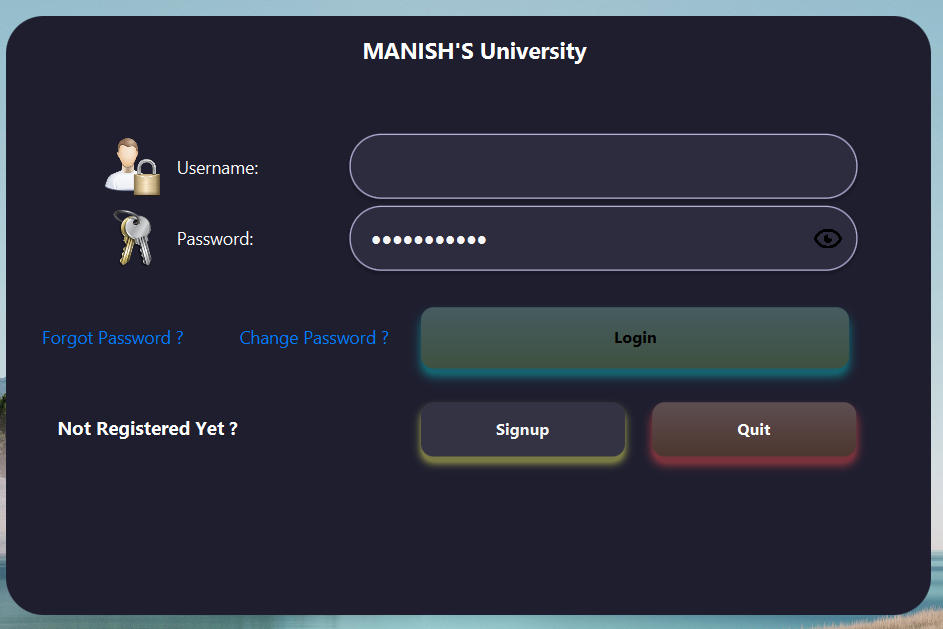 | 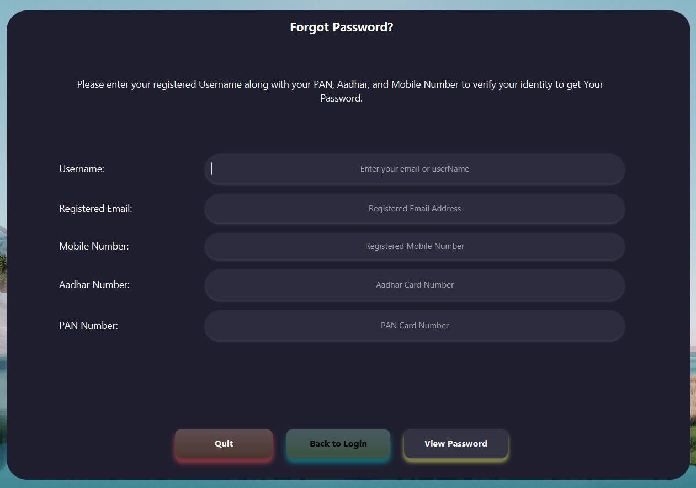 | 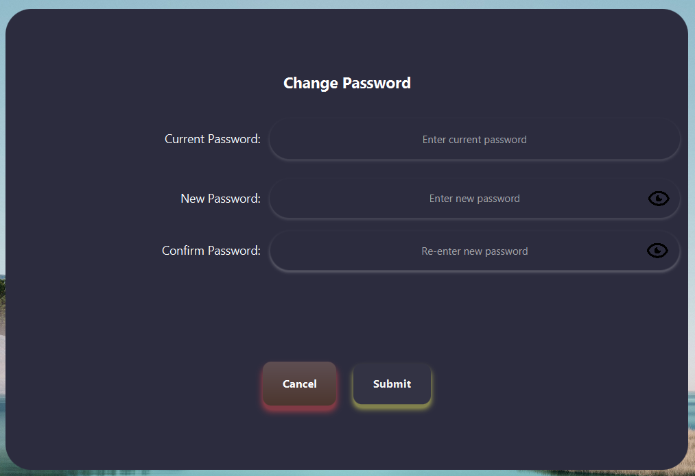 | 

| Signup Screen                                                | View Faculty Member                                           | Admin Dashbord Screen                                                |
|--------------------------------------------------------------|---------------------------------------------------------------|----------------------------------------------------------------------|
| 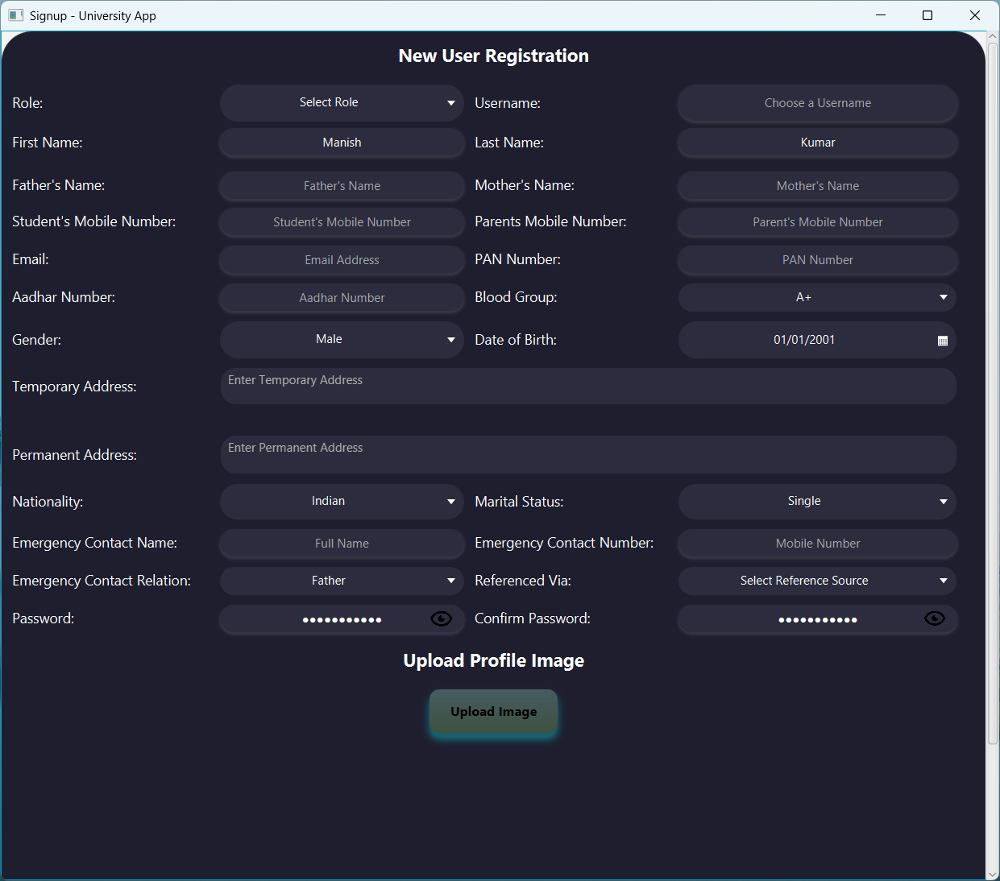 | 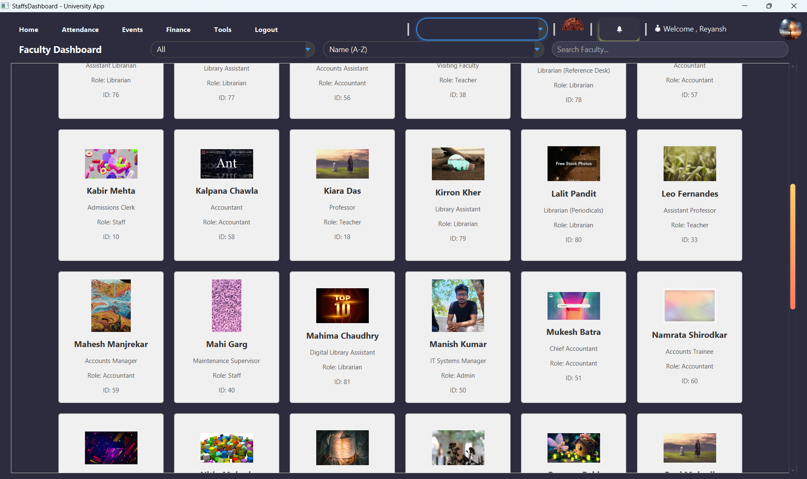 | 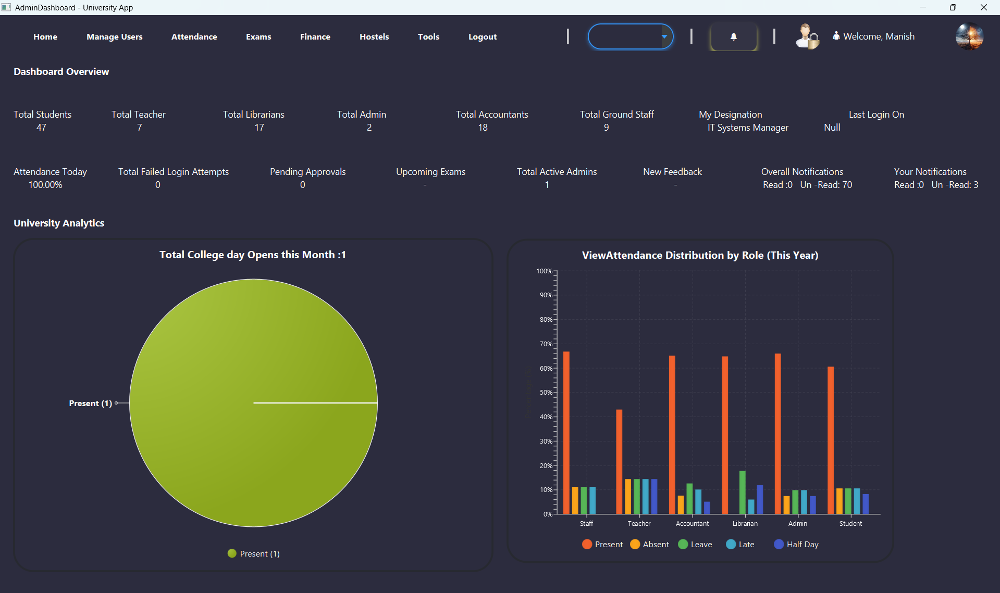 |

| View Attendance Screen                                               | Student Dashboard                                                       | Staffs Dashboard Screen                                               |
|----------------------------------------------------------------------|-------------------------------------------------------------------------|-----------------------------------------------------------------------|
| 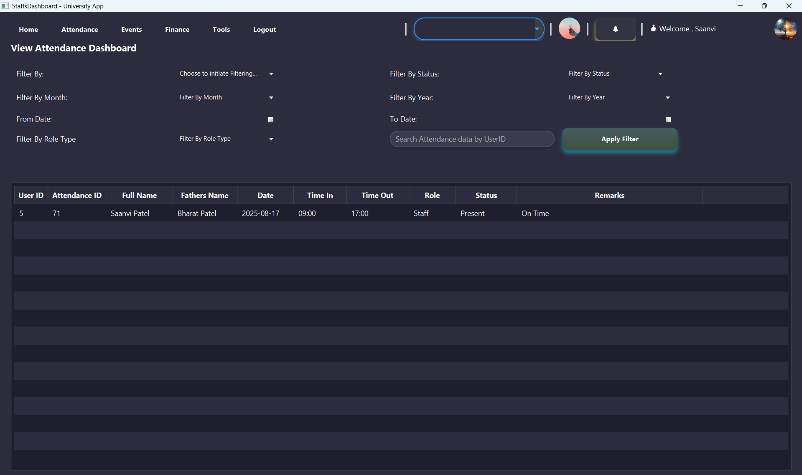 | 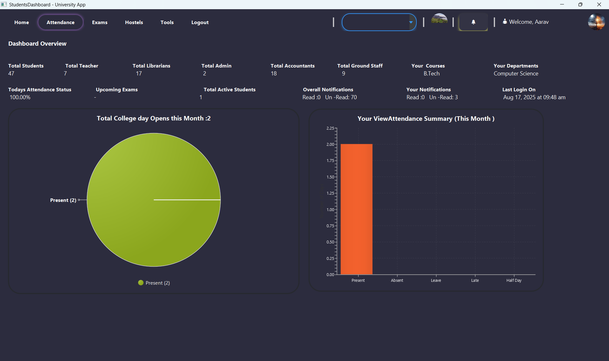 | 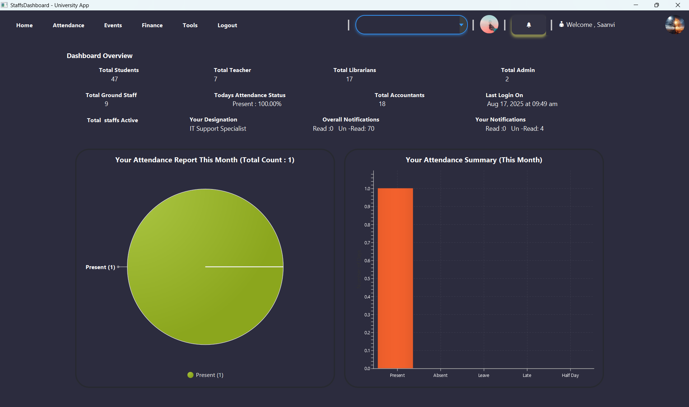 |

| Salary Distribution Screen                                               | Results                                                      | View Profile Screen                                               |
|--------------------------------------------------------------------------|--------------------------------------------------------------|-------------------------------------------------------------------|
| 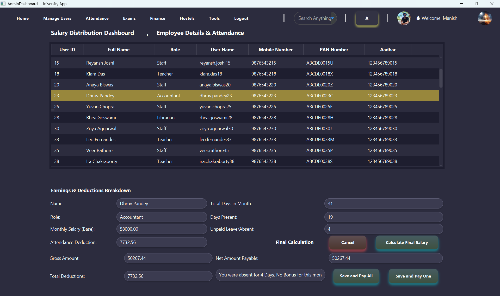 | 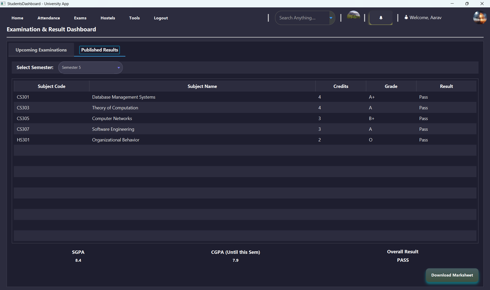 | 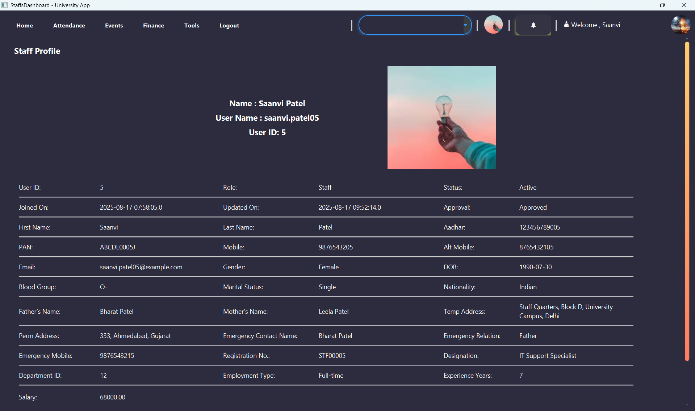 |

| Notifications Screen                                                | Mark Attendance Screen                                               | Students Fees Screen                                       |
|---------------------------------------------------------------------|----------------------------------------------------------------------|------------------------------------------------------------|
| 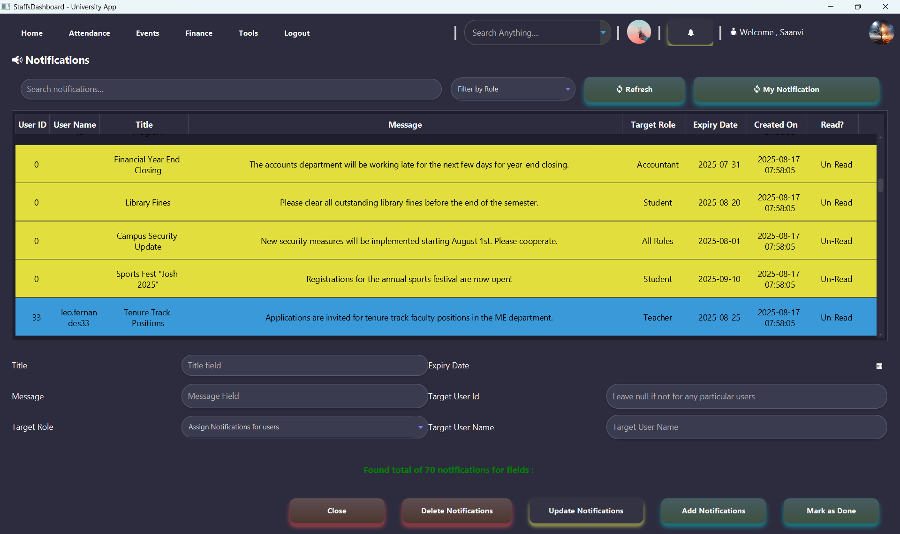 | 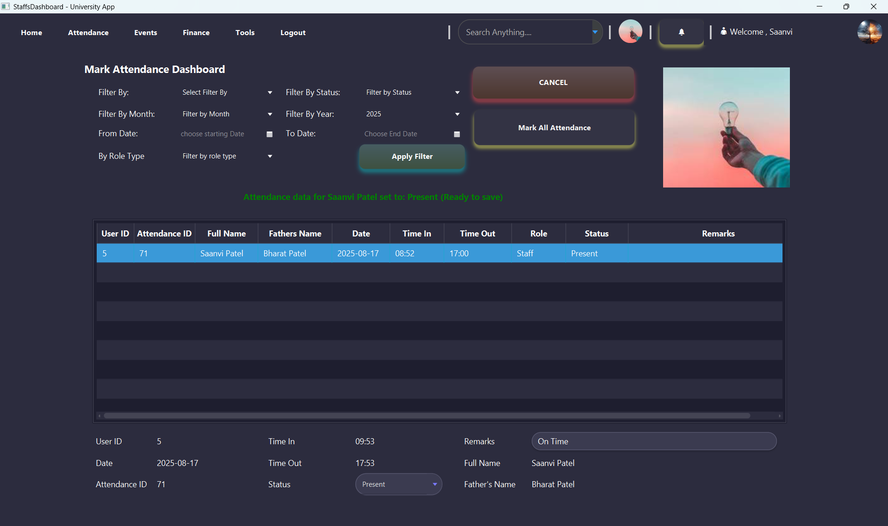 | 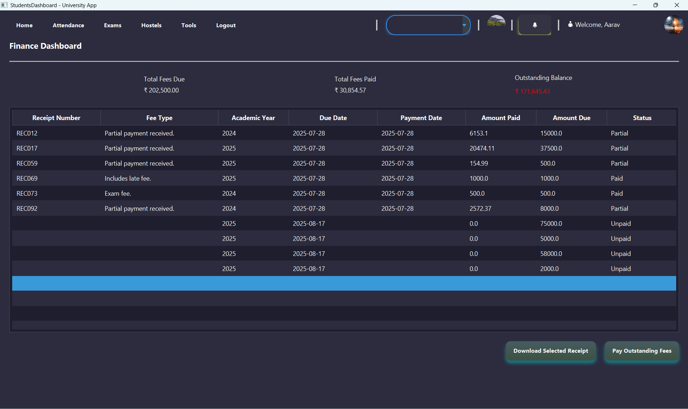 |

---

## 🚀 Features

### ✨ Rich & Interactive JavaFX GUI

- A modern, visually appealing user interface built with JavaFX.
- Custom-styled alerts, buttons, and UI components for a consistent look and feel.
- Engaging 3D animations and sound effects for a dynamic user experience.

### 🔐 Secure Authentication & Session Management

- Robust, role-based login system with database validation.
- Secure password change and "Forgot Password" functionality.
- Session management to keep user data safe and track login status.

### 👑 Comprehensive Admin Dashboard

- At-a-glance overview of key university metrics: student count, attendance, etc.
- Centralized management of all university modules.
- Analytics charts for enrollment trends, attendance, and departmental stats.

### 🎓 Full-Scale User Management

- Admins can manage detailed profiles for Students, Teachers, and Staff.
- Control user roles, statuses (Active, Inactive), and approval states.

### 📚 Academic & Campus Modules

- Student & Faculty Management: Onboard, view, and manage all users.
- Course & Department: Organize academic structures and course offerings.
- Attendance & Timetable: Track daily attendance and manage schedules.
- Examination & Results: Oversee exam processes and publish results.
- Library, Hostel & Transport: Manage essential campus services.
- Fees & Finance: Handle financial records and fee payments.
- Events, Feedback & Logs: Announce events, handle feedback, and maintain system logs.

### 🗃️ Robust MySQL Database Backend

- All university data is securely stored and managed in a relational MySQL database.
- Well-structured tables for users, authentication, attendance, and more, ensuring data
  integrity.

---

## 🔧 Technologies & Tools Used

| Technology        | Role & Description                                                                      |
|-------------------|-----------------------------------------------------------------------------------------|
| **Java (JDK 21)** | Core application logic, backend functionality, and data handling.                       |
| **JavaFX**        | Framework for building the modern, responsive, and interactive GUI.                     |
| **FXML**          | Used to define the structure and layout of the user interface.                          |
| **CSS**           | Applied for all custom styling, theming, and component design.                          |
| **MySQL**         | Relational database for storing all university data (users, courses, attendance, etc.). |
| **JDBC**          | Standard Java API for connecting the application to the MySQL database.                 |
| **Maven**         | Manages project dependencies, plugins, and the overall build process.                   |

---

## ⬇️ Download & Run

### 🔗 Clone the Repository

```bash
    git clone https://github.com/manishrnl/University_Management_System.git
    cd University_Management_System

```

---

## 🧭 Instructions

- Set up MySQL and import the provided SQL script.

- Configure your DB credentials inside the Java project.

- Add all Library which is binded inside folder
  Libraries  used in Projects/ to the Project Structure so as to use libraries that is needed in this project.

- Install Maven dependencies by running the following command in the terminal:

```bash
    mvn clean install
```

- Compile and run the main Java class (e.g., Main_Application.java located at
  src/main/java/org/example/university_management_system/Main_Application.java).

- Use test account credentials or register new users.

## 📌 Requirements

- ✅ Java 24+
- ✅ MySQL Database
- ✅ JDBC Driver
- ✅ IntelliJ IDEA or VS Code

## 📣 Future Enhancements

- 📧 Email/SMS notifications
- 📱 Android integration
- 🌐 Web Integration using Spring Boot and React.js

## 👨‍💻 Developed By

- **Manish Kumar**
- 📧 manishrajrnl1@gmail.com
- 🔗 [My Github Profile](https://github.com/manishrnl/complete_university_management_system.git)

## 📂 Project Structure

```bash
📁 complete_university_management_system/
│
├── 📁 Bundled Software/
│   ├── ⚙️ Complete_UMS.exe
│   ├── ☕ Complete_UMS.jar
│   └── 📖 README.md
│
├── 📁 Libraries used in Project/
│   ├── ☕ commons-compress-1.26.0.jar
│   ├── ☕ commons-lang3-3.12.0.jar
│   ├── ☕ controlsfx-8.40.11.jar
│   ├── ☕ fontawesomefx-8.9.jar
│   ├── ☕ fontawesomefx-commons-8.15.jar
│   ├── ☕ fontawesomefx-controls-8.15.jar
│   ├── ☕ fontawesomefx-emojione-2.2.7-2.jar
│   ├── ☕ fontawesomefx-fontawesome-4.7.0-5.jar
│   ├── ☕ fontawesomefx-glyphsbrowser-1.3.0.jar
│   ├── ☕ fontawesomefx-icons525-3.0.0-4.jar
│   ├── ☕ fontawesomefx-materialdesignfont-1.7.22-4.jar
│   ├── ☕ fontawesomefx-materialicons-2.2.0-5.jar
│   ├── ☕ fontawesomefx-octicons-4.3.0-5.jar
│   ├── ☕ fontawesomefx-weathericons-2.0.10-5.jar
│   ├── ☕ jcalendar-0.8.1.jar
│   ├── ☕ jcalendar-tz-1.3.3-4.jar
│   ├── ☕ mysql-connector-java-8.0.28.jar
│   ├── ☕ poi-5.1.0.jar
│   ├── ☕ poi-examples-5.1.0.jar
│   ├── ☕ poi-excelant-5.1.0.jar
│   ├── ☕ poi-javadoc-5.1.0.jar
│   ├── ☕ poi-ooxml-5.1.0.jar
│   ├── ☕ poi-ooxml-full-5.1.0.jar
│   ├── ☕ xmlbeans-3.1.0.jar
│   └── ☕ xmlbeans-5.1.1.jar
│
├── 📁 ScreenShot/
│   ├── 🖼️ adminDashboard.png
│   ├── 🖼️ changePassword.png
│   ├── 🖼️ faculty.png
│   ├── 🖼️ fees.png
│   ├── 🖼️ forgetPassword.png
│   ├── 🖼️ login.png
│   ├── 🖼️ markAttendance.png
│   ├── 🖼️ notifications.png
│   ├── 🖼️ profileView.png
│   ├── 🖼️ result.png
│   ├── 🖼️ salaryDistribution.png
│   ├── 🖼️ signup.png
│   ├── 🖼️ staffsDashboard.png
│   ├── 🖼️ studentsDashboard.png
│   └── 🖼️ viewAttendance.png
│
│ 
├── 📁 src/
│   └── 📁 main/
│       ├── 📁 java/
│       │   ├── ☕ module-info.java
│       │   └── 📁 org/
│       │       └── 📁 example/
│       │           └── 📁 complete_ums/
│       │               ├── 🔒 ChangePassword.java
│       │               ├── 🔓 ChangePasswordWithoutLoggingIn.java
│       │               ├── 🗓️ Events.java
│       │               ├── 🔑 ForgetPassword_Controller.java
│       │               ├── ➕ InsertMissingFieldsIntoSQLTable.java
│       │               ├── 🚪 Login_Controller.java
│       │               ├── 🚀 Main_Application.java
│       │               ├── 📝 MarkAttendance.java
│       │               ├── 🔔 Notification_Controller.java
│       │               ├── 💰 SalaryDistributionController.java
│       │               ├── 📄 Total lines Count.txt
│       │               ├── 📝 Signup_Controller.java
│       │               ├── 👁️ ViewAttendance.java
│       │               ├── 👁️ ViewSalary.java
│       │               ├── 📁 Accountants/
│       │               │   ├── ☕ AccountantController.java
│       │               │   ├── ☕ AccountantsDashboardContent.java
│       │               │   ├── ☕ AccountantsProfileView.java
│       │               │   └── ☕ FeesCollection.java
│       │               ├── 📁 Admin/
│       │               │   ├── 👨‍💼 AccountantManagement.java
│       │               │   ├── ☕ AdminController.java
│       │               │   ├── ☕ TeachersContentsController.java
│       │               │   ├── 👨‍💼 AdminManagement.java
│       │               │   ├── 👤 AdminProfileView.java
│       │               │   ├── 📚 Courses.java
│       │               │   ├── 📜 Exams.java
│       │               │   ├── 🧑‍🏫 Faculty.java
│       │               │   ├── 💬 Feedback.java
│       │               │   ├── 💸 Finance.java
│       │               │   ├── 👷 GroundStaffManagement.java
│       │               │   ├── 🏠 Hostel.java
│       │               │   ├── 📖 LibrariansManagement.java
│       │               │   ├── 🏛️ Library.java
│       │               │   ├── ⚙️ Logs.java
│       │               │   ├── 🔧 Settings.java
│       │               │   ├── 🧑‍🎓 StudentManagement.java
│       │               │   └── 🧑‍🏫 TeacherManagement.java
│       │               ├── 📁 CommonTable/
│       │               │   ├── ☕ AdminLogsTable.java
│       │               │   ├── ☕ AttendanceTable.java
│       │               │   ├── ☕ BorrowedBooksTable.java
│       │               │   ├── ☕ Employee.java
│       │               │   ├── ☕ EventListView.java
│       │               │   ├── ☕ ExamsTable.java
│       │               │   ├── ☕ FacultyMember.java
│       │               │   ├── ☕ Fee_Collection_Table.java
│       │               │   ├── ☕ Fee_Collection_Table_Searching.java
│       │               │   ├── ☕ FinanceFeeTable.java
│       │               │   ├── ☕ GroundStaffTable.java
│       │               │   ├── ☕ LibrariansTable.java
│       │               │   ├── ☕ Manage_Students_Table.java
│       │               │   ├── ☕ NotificationsTable.java
│       │               │   ├── ☕ ResultsTable.java
│       │               │   ├── ☕ SalaryComponent.java
│       │               │   ├── ☕ SalaryComponentLoader.java
│       │               │   ├── ☕ SalaryDistributionTable.java
│       │               │   ├── ☕ SalaryTable.java
│       │               │   ├── ☕ TeacherTable.java
│       │               │   └── ☕ ViewOrReturnBooksTable.java
│       │               ├── 📁 Databases/
│       │               │   ├── 📜 AdminActivityLogs.java
│       │               │   ├── 🔑 AuthenticationSQLQuery.java
│       │               │   ├── 💾 DatabaseConnection.java
│       │               │   ├── 📄 ResultSetProcessor.java
│       │               │   ├── 👤 User.java
│       │               │   ├── 👩‍💻 UserService.java
│       │               │   └── 🔑 UsersSQLQuery.java
│       │               ├── 📁 Java_StyleSheet/
│       │               │   ├── 🎨 Button3DEffect.java
│       │               │   ├── 🎨 Change_Frame_Size.java
│       │               │   ├── 🎨 EdgeColorAnimation.java
│       │               │   ├── 🎨 RoundedImage.java
│       │               │   └── 🎨 Theme_Manager.java
│       │               ├── 📁 Librarians/
│       │               │   ├── 📚 AddBooks.java
│       │               │   ├── 📖 IssueBooks.java
│       │               │   ├── ☕ LibrarianController.java
│       │               │   ├── ☕ LibrariansDashboardContent.java
│       │               │   ├── 👤 LibrariansProfileView.java
│       │               │   ├── ✏️ UpdateBooks.java
│       │               │   └── 📖 ViewOrReturnBooks.java
│       │               ├── 📁 Staffs/
│       │               │   ├── ☕ StaffsController.java
│       │               │   ├── ☕ StaffsDashboardContent.java
│       │               │   └── 👤 StaffsProfileView.java
│       │               ├── 📁 Students/
│       │               │   ├── 📜 Exams.java
│       │               │   ├── 💸 Finance.java
│       │               │   ├── 🚌 HostelTransport.java
│       │               │   ├── 🏛️ Library.java
│       │               │   ├── ☕ StudentsController.java
│       │               │   ├── ☕ StudentsDashboardContent.java
│       │               │   ├── 👤 StudentsProfile.java
│       │               │   ├── 🗓️ TimeTable.java
│       │               │   └── 📖 ViewIssuedBooks.java
│       │               ├── 📁 Teachers/
│       │               │   └── ☕ TeacherController.java
│       │               │   └── ☕ TeachersContentsController.java
│       │               │   └── 👤 ViewTeachersProfile.java
│       │               └── 📁 ToolsClasses/
│       │                   ├── 🔔 AlertManager.java
│       │                   ├── ⚙️ AppProperties.java
│       │                   ├── ⚙️ CustomAlertController.java
│       │                   ├── 🖼️ LoadFrame.java
│       │                   ├── 🗺️ NavigationManager.java
│       │                   ├── 🔑 SessionManager.java
│       │                   └── 📜 WrappedTextCellFactory.java
│       │
│       └── 📁 resources/
│           ├── ⚙️ application.properties
│           ├── 📁 META-INF/
│           │   └── 📄 MANIFEST.MF
│           ├── 📁 org/
│           │   └── 📁 example/
│           │       └── 📁 complete_ums/
│           │           ├── 🔒 changePassword.fxml
│           │           ├── 🔓 changePasswordWithoutLoggingIn.fxml
│           │           ├── ⚙️ customAlerts.fxml
│           │           ├── 🗓️ Events.fxml
│           │           ├── 🔑 ForgetPassword.fxml
│           │           ├── ➕ InsertMissingFieldsIntoSQLTable.fxml
│           │           ├── 🚪 Login.fxml
│           │           ├── 📝 MarkAttendance.fxml
│           │           ├── 🔔 Notifications.fxml
│           │           ├── 💰 SalaryDistribution.fxml
│           │           ├── 📝 Signup.fxml
│           │           ├── 👁️ ViewAttendance.fxml
│           │           ├── 👁️ ViewSalary.fxml
│           │           ├── 📁 Accountants/
│           │           │   ├── ☕ AccountantsDashboard.fxml
│           │           │   ├── ☕ AccountantsDashboardContent.fxml
│           │           │   ├── 👤 accountantsProfileView.fxml
│           │           │   └── 💰 feesCollection.fxml
│           │           ├── 📁 Admin/
│           │           │   ├── 👨‍💼 AccountantManagement.fxml
│           │           │   ├── ☕ AdminDashboard.fxml
│           │           │   ├── ☕ TeachersContentsController.fxml
│           │           │   ├── 👨‍💼 AdminManagement.fxml
│           │           │   ├── 👤 AdminProfileView.fxml
│           │           │   ├── 📚 courses.fxml
│           │           │   ├── 📜 exams.fxml
│           │           │   ├── 🧑‍🏫 faculty.fxml
│           │           │   ├── 💬 feedback.fxml
│           │           │   ├── 👷 GroundStaffManagement.fxml
│           │           │   ├── 📖 LibrariansManagement.fxml
│           │           │   ├── ⚙️ logs.fxml
│           │           │   ├── 🔧 settings.fxml
│           │           │   ├── 🧑‍🎓 StudentsManagement.fxml
│           │           │   └── 🧑‍🏫 TeacherManagement.fxml
│           │           ├── 📁 Images/
│           │           │   ├── 🖼️ Arrow Keys.webp
│           │           │   ├── 🖼️ Back.PNG
│           │           │   ├── 🖼️ close.png
│           │           │   ├── 🖼️ confirmation.png
│           │           │   ├── 🖼️ day_night_toggle_theme.jpeg
│           │           │   ├── 🖼️ error.png
│           │           │   ├── 🖼️ Forward.PNG
│           │           │   ├── 🖼️ HidePassword.jpg
│           │           │   ├── 🖼️ info.png
│           │           │   ├── 🖼️ Maximize.png
│           │           │   ├── 🖼️ Minimize.png
│           │           │   ├── 🖼️ password.png
│           │           │   ├── 🖼️ ShowPassword.png
│           │           │   ├── 🖼️ UserName.png
│           │           │   └── 🖼️ warning.png
│           │           ├── 📁 Librarians/
│           │           │   ├── 📚 AddBooks.fxml
│           │           │   ├── 📖 IssueBooks.fxml
│           │           │   ├── 👤 LibrarianProfileView.fxml
│           │           │   ├── ☕ LibrariansDashboard.fxml
│           │           │   ├── ☕ LibrariansDashboardContent.fxml
│           │           │   ├── 💰 SalaryDistribution.fxml
│           │           │   ├── ✏️ UpdateBooks.fxml
│           │           │   └── 📖 ViewOrReturnBooks.fxml
│           │           ├── 📁 Staffs/
│           │           │   ├── ☕ StaffsDashboard.fxml
│           │           │   ├── ☕ StaffsDashboardContent.fxml
│           │           │   └── 👤 StaffsProfileView.fxml
│           │           ├── 📁 Students/
│           │           │   ├── 📜 Exams.fxml
│           │           │   ├── 💸 Finance.fxml
│           │           │   ├── 🚌 HostelTransport.fxml
│           │           │   ├── 🏛️ Library.fxml
│           │           │   ├── ☕ StudentsDashboard.fxml
│           │           │   ├── ☕ StudentsDashboardContent.fxml
│           │           │   ├── 👤 StudentsProfile.fxml
│           │           │   ├── 🗓️ TimeTable.fxml
│           │           │   └── 📖 viewIssuedBooks.fxml
│           │           ├── 📁 Stylesheet/
│           │           │   ├── 🖌️ Custom-Theme.css
│           │           │   ├── 🖌️ Dark_Theme.css
│           │           │   └── 🖌️ Light-Theme.css
│           │           └── 📁 Teachers/
│           │               └── ☕ TeachersDashboardContent.fxml
│           │               └── ☕ TeachersDashboard.fxml
│           │               └── 👤 viewTeachersProfile.fxml
│           │
│           └── 📁 sound/
│               ├── 🎵 error.mp3
│               ├── 🎵 hover.mp3
│               └── 🎵 sound2.mp3
│
├── 💾 DataBase.sql
├── 🚫 .gitignore
├── 📄 DataBase.sql
├── 📖 README.md
├── ⚙️ Save_Themes.properties
├── ⚙️ mvnw
├── ⚙️ mvnw.cmd
├── 📄 pom.xml
└── 📄 push into github.txt

```

## To count all Lines for project , paste script inside powershell inside root folder

```bash
    $files = Get-ChildItem -Recurse -Include *.java, *.fxml, *.css src\main
    $allLines     = 0
    $commentLines = 0
    foreach ($file in $files) {
       $lines = Get-Content $file
       $allLines += $lines.Count
        foreach ($line in $lines) {
           $trim = $line.Trim()
            if ($trim -match '^//' -or              # Java single-line comment
               $trim -match '^/\*' -or             # Start of block comment
                $trim -match '^\*' -or              # Inside block comment
               $trim -match '^\*/' -or             # End of block comment
               $trim -match '^<!--' -or            # XML/FXML comment
                $trim -match '^-->' -or             # End XML comment
                $trim -match '^\*\/'                # Closing CSS/Java comment
            ) {
                $commentLines++
            }
        }
    }
    Write-Host "Total Lines Including Comments  : $allLines"
    Write-Host "Comment Lines : $commentLines"
    Write-Host "Code Lines Excluding Comments   : $($allLines - $commentLines)"


```
## Projects Ends here. Projects Length = 30,000 lines approx.
